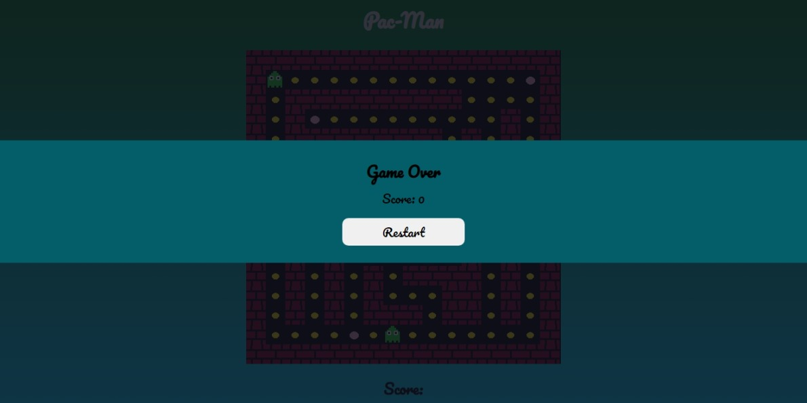
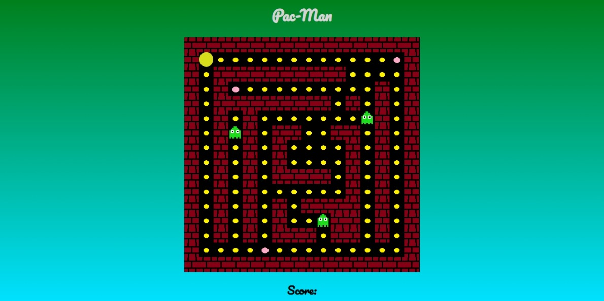

# PACMAN GAME

## Table of contents
- [Overview](#overview)
    - [Screenshots](#screenshots)
    - [Links](#links)
- [Process](#process)
    - [Tools used](#tools-used)
    - [Project Description](#project-description)
- [Author](#author)
- [Acknowledgement](#acknowledgement)

## Overview
### Screenshots

### Links
- [Github repository](https://github.com/Emmanuel-Afrifa/Pac-man-game)
- [Deployed site](https://pacman-exciting.netlify.app/)

## Process
### Tools Used
- HTML5
- CSS
- Flexbox
- JavaScript

## Project Description
- The game is only playable on a screen size of at least 530px width and 650px height.
- There is an option to restart the game when the user wins or it's game over.

## Author
- Emmanuel Afrifa
- [emmaquame9@gmail.com](mailto:emmaquame9@gmail.com)
- [Frontend-Mentor](https://www.frontendmentor.io/profile/Emmanuel-Afrifa)
- [Twitter](https://twitter.com/Emma33712365)
- [Linkedin](https://www.linkedin.com/in/emmanuel-afrifa-840674214/)

## Acknowledgement
- [1 hour Pac-man in JavaScript!](https://www.youtube.com/watch?v=q2ViNbRwr5U)
- [Coding Pac-Man in JavaScript Complete Tutorial Every Step Explained](https://www.youtube.com/watch?v=Tk48dQCdQ3E)

